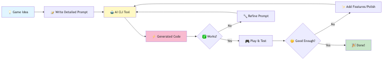

# 🎮 AI Game Generation Workshop

Welcome to the AI Game Generation Workshop! This repository is designed to demonstrate how AI, specifically Large Language Models (LLMs), can be used as a powerful assistant in game development.

## 🎯 Project Overview

The goal of this workshop is to show you how to go from a detailed game design document to a fully playable game using an AI-powered CLI tool. We will use AI to generate Python code for classic games like Snake and Pong. This approach helps in rapid prototyping and understanding the structure of a game.

<p align="center">


</p>

## 🚀 Getting Started

To run the games in this repository, you'll need to set up your environment.

### 1. Install Python

Ensure you have Python 3 installed on your system. You can download it from [python.org](https://www.python.org/).

### 2. Install Game Dependencies

This project uses the `pygame` library. You can install it and other potential dependencies using the `requirements.txt` file.

Open your terminal or command prompt and run:
```bash
pip install -r requirements.txt
```

### 3. (Optional) Install AI CLI Tools

To fully participate in the interactive part of the workshop, you should install an AI-powered CLI tool. Instructions for installing Gemini CLI and GitHub Copilot CLI can be found in the `docs` folder.

- **[CLI Tool Installation Guide](./docs/installation.md)**

## 📂 Key Files Explained

- **`game_design_prompt_*.md`**: These are the detailed design documents for each game. We provide these to the AI to tell it what kind of game we want to build. They specify everything from gameplay mechanics to art style.

- **`requirements.txt`**: This file lists all the Python libraries needed for this project (like `pygame`). The `pip install -r requirements.txt` command reads this file and installs everything automatically.

- **`*.py`**: These are the Python files containing the game code, generated by the AI based on our prompts.

## 🕹️ The Games

Here are the games we've created.

### 🐍 Snake Game

A classic implementation of the Snake game.

**To Run:**
```bash
python snake_game.py
```

### 🏓 Ping Pong Game

A classic two-player Ping Pong game.

**Controls:**
- **Player 1 (Left):** 'W' (up) and 'S' (down)
- **Player 2 (Right):** Up Arrow (up) and Down Arrow (down)

**To Run:**
```bash
python pong_game.py
```

## Licence
This project is licensed under the MIT License - see the [LICENSE](LICENSE) file for details.

Designed by T. Wang

Since 10/2025
