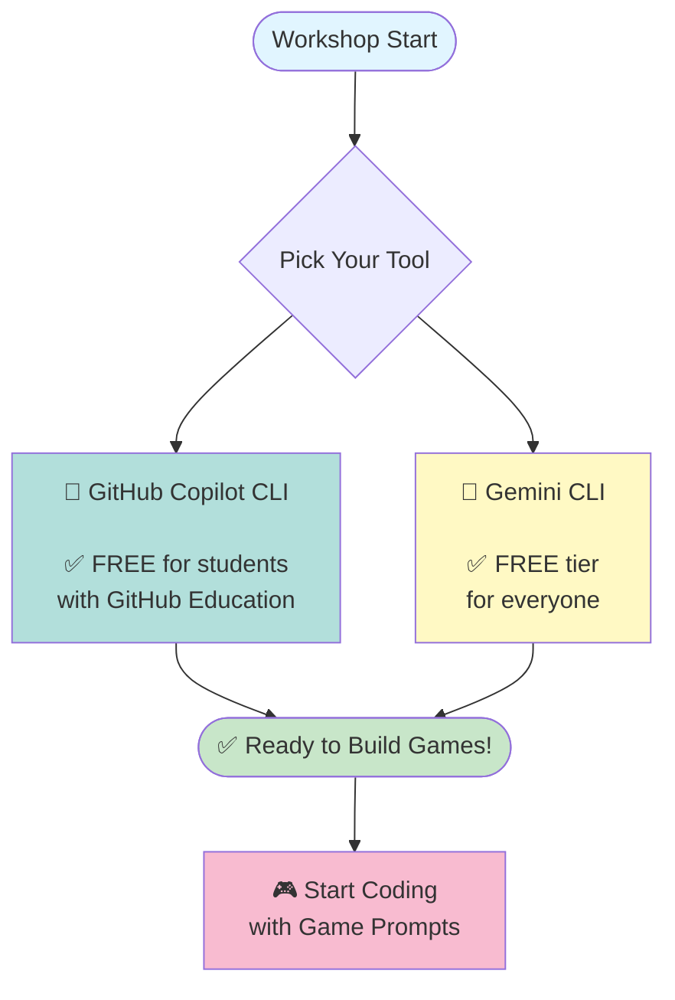

```mermaid
flowchart TB
    Start(["Workshop Start"]) --> Tools{"Pick Your Tool"}
    Tools --> Copilot["🔷 GitHub Copilot CLI<br><br>✅ FREE for students<br>with GitHub Education<br>"] & Gemini["🔷 Gemini CLI<br><br>✅ FREE tier<br>for everyone<br>"]
    Ready(["✅ Ready to Build Games!"]) --> Code["🎮 Start Coding<br>with Game Prompts"]
    Copilot --> Ready
    Gemini --> Ready

    style Start fill:#e1f5ff
    style Copilot fill:#b2dfdb
    style Gemini fill:#fff9c4
    style Ready fill:#c8e6c9
    style Code fill:#f8bbd0

```
