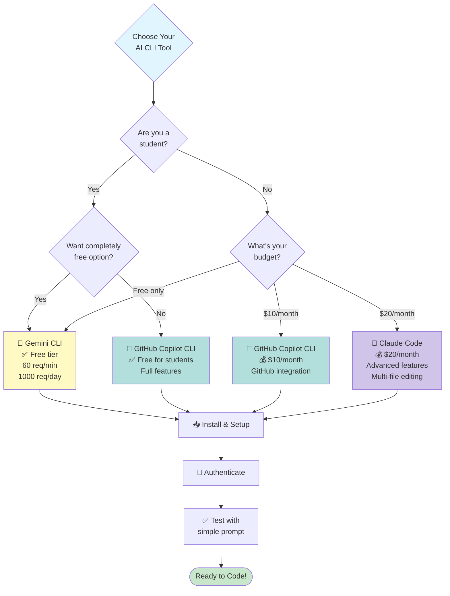

# AI CLI Tool Selection Guide

```mermaid
flowchart TD
    Start{Choose Your<br/>AI CLI Tool} --> Student{Are you a<br/>student?}

    Student -->|Yes| Free{Want completely<br/>free option?}
    Student -->|No| Budget{What's your<br/>budget?}

    Free -->|Yes| Gemini[🔷 Gemini CLI<br/>✅ Free tier<br/>60 req/min<br/>1000 req/day]
    Free -->|No| GHStudent[🔷 GitHub Copilot CLI<br/>✅ Free for students<br/>Full features]

    Budget -->|$10/month| GH[🔷 GitHub Copilot CLI<br/>💰 $10/month<br/>GitHub integration]
    Budget -->|$20/month| Claude[🔷 Claude Code<br/>💰 $20/month<br/>Advanced features<br/>Multi-file editing]
    Budget -->|Free only| Gemini

    Gemini --> Setup[📥 Install & Setup]
    GHStudent --> Setup
    GH --> Setup
    Claude --> Setup

    Setup --> Auth[🔐 Authenticate]
    Auth --> Test[✅ Test with<br/>simple prompt]
    Test --> Ready([Ready to Code!])

    style Start fill:#e1f5ff
    style Ready fill:#c8e6c9
    style Gemini fill:#fff9c4
    style GHStudent fill:#b2dfdb
    style GH fill:#b2dfdb
    style Claude fill:#d1c4e9
```
