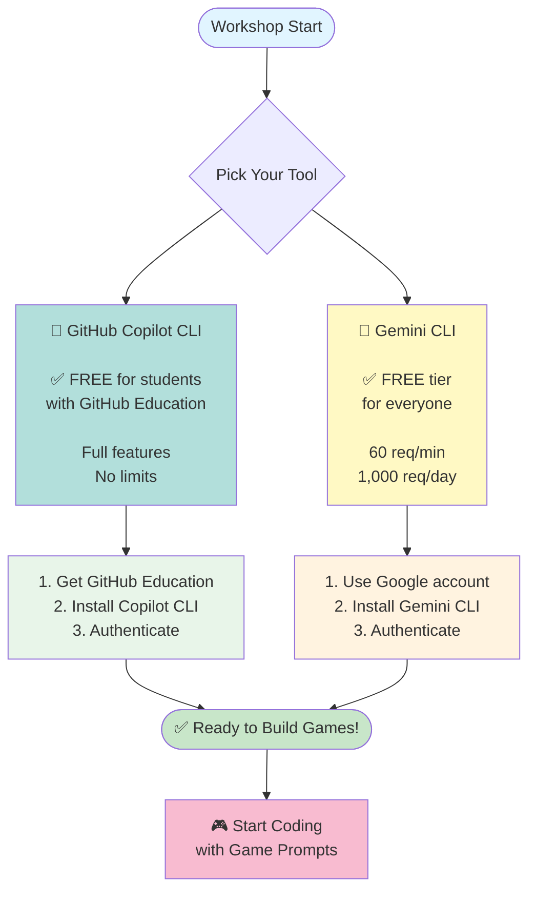

# AI CLI Tools for This Workshop

```mermaid
flowchart TB
    Start([Workshop Start]) --> Tools{Pick Your Tool}

    Tools --> Copilot[🔷 GitHub Copilot CLI<br/><br/>✅ FREE for students<br/>with GitHub Education<br/><br/>Full features<br/>No limits]
    Tools --> Gemini[🔷 Gemini CLI<br/><br/>✅ FREE tier<br/>for everyone<br/><br/>60 req/min<br/>1,000 req/day]

    Copilot --> CopilotSteps[1. Get GitHub Education<br/>2. Install Copilot CLI<br/>3. Authenticate]
    Gemini --> GeminiSteps[1. Use Google account<br/>2. Install Gemini CLI<br/>3. Authenticate]

    CopilotSteps --> Ready([✅ Ready to Build Games!])
    GeminiSteps --> Ready

    Ready --> Code[🎮 Start Coding<br/>with Game Prompts]

    style Start fill:#e1f5ff
    style Ready fill:#c8e6c9
    style Code fill:#f8bbd0
    style Copilot fill:#b2dfdb
    style Gemini fill:#fff9c4
    style CopilotSteps fill:#e8f5e9
    style GeminiSteps fill:#fff3e0
```
