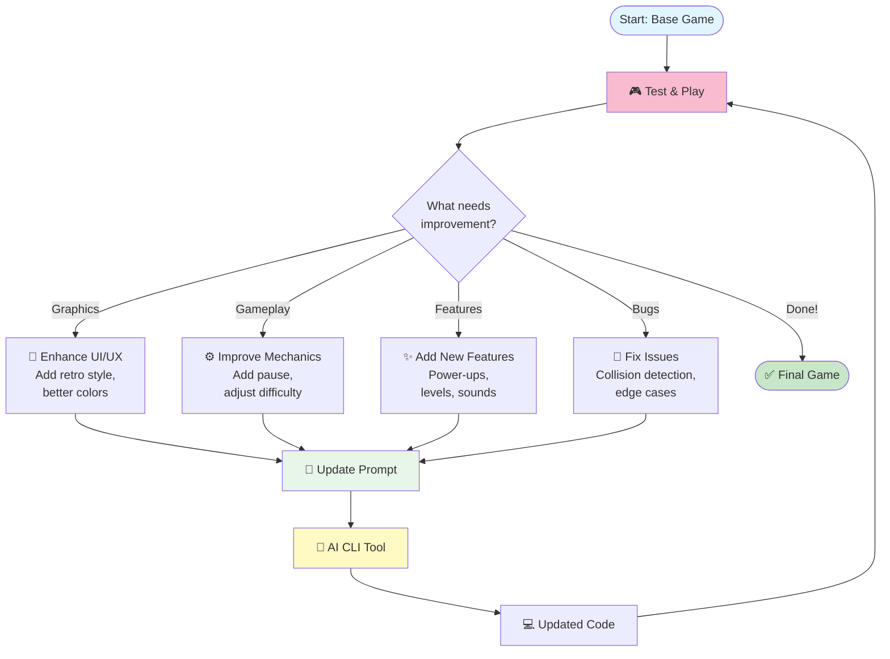

# Development Iteration Cycle

```mermaid
flowchart TB
    Start([Start: Base Game]) --> Test[🎮 Test & Play]
    Test --> Feedback{What needs<br/>improvement?}

    Feedback -->|Graphics| Graphics[🎨 Enhance UI/UX<br/>Add retro style,<br/>better colors]
    Feedback -->|Gameplay| Gameplay[⚙️ Improve Mechanics<br/>Add pause,<br/>adjust difficulty]
    Feedback -->|Features| Features[✨ Add New Features<br/>Power-ups,<br/>levels, sounds]
    Feedback -->|Bugs| Bugs[🐛 Fix Issues<br/>Collision detection,<br/>edge cases]
    Feedback -->|Done!| Done([✅ Final Game])

    Graphics --> Prompt[📝 Update Prompt]
    Gameplay --> Prompt
    Features --> Prompt
    Bugs --> Prompt

    Prompt --> AI[🤖 AI CLI Tool]
    AI --> Code[💻 Updated Code]
    Code --> Test

    style Start fill:#e1f5ff
    style Done fill:#c8e6c9
    style AI fill:#fff9c4
    style Test fill:#f8bbd0
    style Prompt fill:#e8f5e9
```
