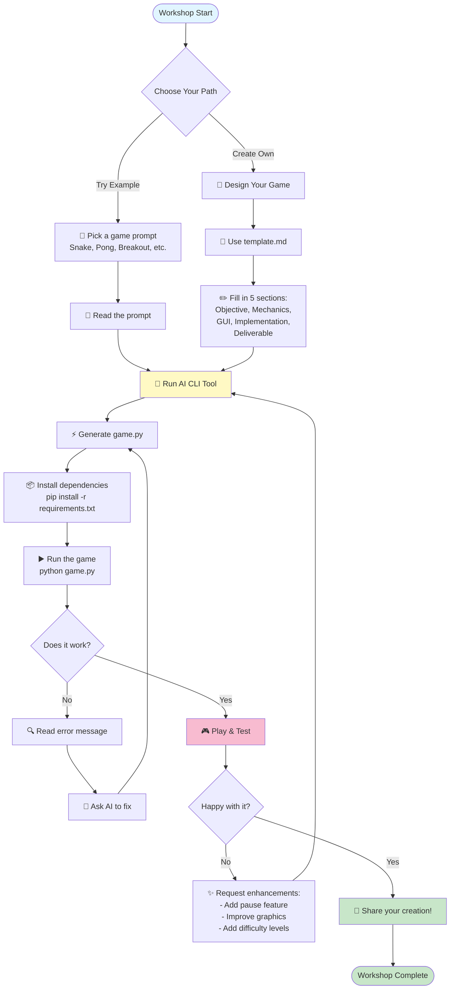

# Game Development Process with AI

```mermaid
flowchart TD
    Start([Workshop Start]) --> Choose{Choose Your Path}

    Choose -->|Try Example| Example[📂 Pick a game prompt<br/>Snake, Pong, Breakout, etc.]
    Choose -->|Create Own| Design[🎨 Design Your Game]

    Example --> Read[📖 Read the prompt]
    Design --> Template[📝 Use template.md]
    Template --> Fill[✏️ Fill in 5 sections:<br/>Objective, Mechanics,<br/>GUI, Implementation,<br/>Deliverable]

    Read --> CLI
    Fill --> CLI[🤖 Run AI CLI Tool]

    CLI --> Generate[⚡ Generate game.py]
    Generate --> Install[📦 Install dependencies<br/>pip install -r requirements.txt]
    Install --> Run[▶️ Run the game<br/>python game.py]

    Run --> Works{Does it work?}
    Works -->|No| Debug[🔍 Read error message]
    Debug --> Fix[📝 Ask AI to fix]
    Fix --> Generate

    Works -->|Yes| Play[🎮 Play & Test]
    Play --> Satisfied{Happy with it?}

    Satisfied -->|No| Enhance[✨ Request enhancements:<br/>- Add pause feature<br/>- Improve graphics<br/>- Add difficulty levels]
    Enhance --> CLI

    Satisfied -->|Yes| Share[🎉 Share your creation!]
    Share --> End([Workshop Complete])

    style Start fill:#e1f5ff
    style End fill:#c8e6c9
    style CLI fill:#fff9c4
    style Play fill:#f8bbd0
    style Share fill:#c8e6c9
```
