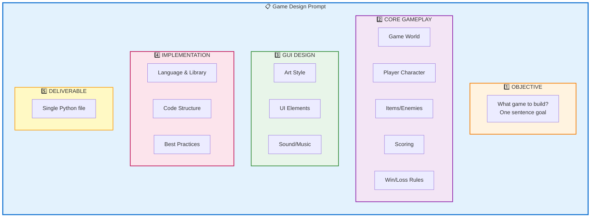

# Prompt Structure - 5 Section Framework

```mermaid
graph TB
    subgraph Main["📋 Game Design Prompt"]
        direction TB

        subgraph Section1["1️⃣ OBJECTIVE"]
            Obj[What game to build?<br/>One sentence goal]
        end

        subgraph Section2["2️⃣ CORE GAMEPLAY"]
            GP1[Game World]
            GP2[Player Character]
            GP3[Items/Enemies]
            GP4[Scoring]
            GP5[Win/Loss Rules]
        end

        subgraph Section3["3️⃣ GUI DESIGN"]
            UI1[Art Style]
            UI2[UI Elements]
            UI3[Sound/Music]
        end

        subgraph Section4["4️⃣ IMPLEMENTATION"]
            Impl1[Language & Library]
            Impl2[Code Structure]
            Impl3[Best Practices]
        end

        subgraph Section5["5️⃣ DELIVERABLE"]
            Del[Single Python file]
        end
    end

    style Section1 fill:#fff3e0,stroke:#f57c00,stroke-width:2px
    style Section2 fill:#f3e5f5,stroke:#8e24aa,stroke-width:2px
    style Section3 fill:#e8f5e9,stroke:#388e3c,stroke-width:2px
    style Section4 fill:#fce4ec,stroke:#c2185b,stroke-width:2px
    style Section5 fill:#fff9c4,stroke:#f9a825,stroke-width:2px
    style Main fill:#e3f2fd,stroke:#1976d2,stroke-width:3px
```
