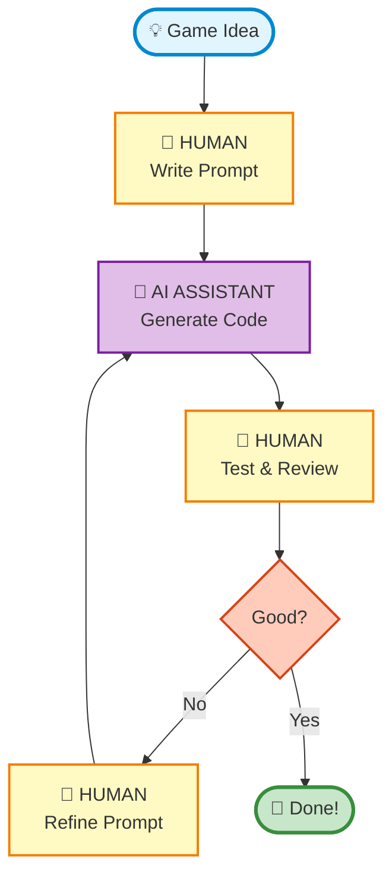

# Vibe Coding Workflow

```mermaid
flowchart TB
    Start([💡 Game Idea]) --> Human1[👤 HUMAN<br/>Write Prompt]
    Human1 --> AI1[🤖 AI ASSISTANT<br/>Generate Code]
    AI1 --> Human2[👤 HUMAN<br/>Test & Review]
    Human2 --> Decision{Good?}
    Decision -->|No| Human3[👤 HUMAN<br/>Refine Prompt]
    Human3 --> AI1
    Decision -->|Yes| End([🎉 Done!])

    style Start fill:#e1f5ff,stroke:#0288d1,stroke-width:3px
    style End fill:#c8e6c9,stroke:#388e3c,stroke-width:3px
    style Human1 fill:#fff9c4,stroke:#f57c00,stroke-width:2px
    style Human2 fill:#fff9c4,stroke:#f57c00,stroke-width:2px
    style Human3 fill:#fff9c4,stroke:#f57c00,stroke-width:2px
    style AI1 fill:#e1bee7,stroke:#7b1fa2,stroke-width:2px
    style Decision fill:#ffccbc,stroke:#d84315,stroke-width:2px
```
