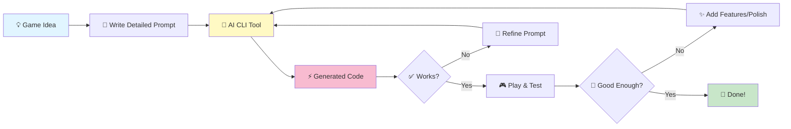

# Vibe Coding Workflow

```mermaid
flowchart LR
    A[💡 Game Idea] --> B[📝 Write Detailed Prompt]
    B --> C[🤖 AI CLI Tool]
    C --> D[⚡ Generated Code]
    D --> E{✅ Works?}
    E -->|Yes| F[🎮 Play & Test]
    E -->|No| G[🔧 Refine Prompt]
    G --> C
    F --> H{🤔 Good Enough?}
    H -->|No| I[✨ Add Features/Polish]
    I --> C
    H -->|Yes| J[🎉 Done!]

    style A fill:#e1f5ff
    style J fill:#c8e6c9
    style C fill:#fff9c4
    style D fill:#f8bbd0
```
